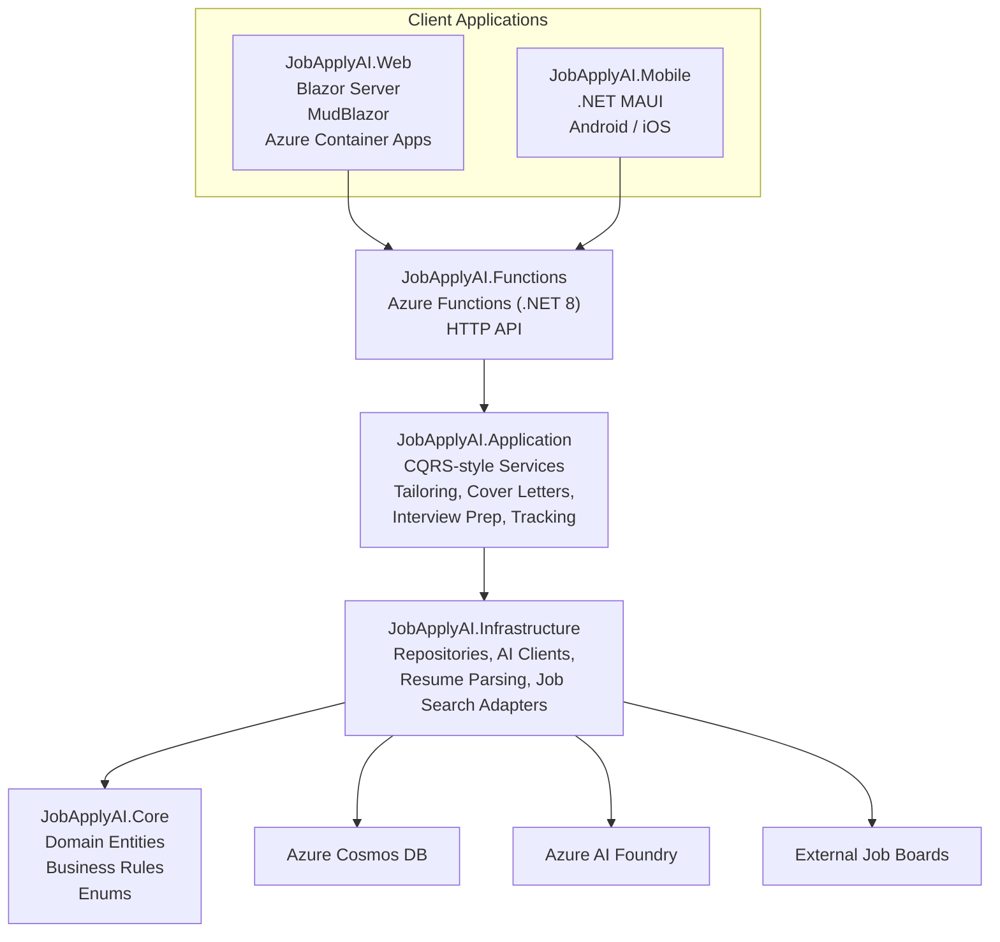

# NextRoleAI

An original AI-powered job-application assistant for the **Australia & New Zealand** market.

> **Note on naming:** the product/display name is **NextRoleAI** (see the app bar, page titles,
> and this README). The underlying solution, project files, and C# namespaces are still named
> `JobApplyAI.*` — renaming those is a purely internal, non-user-facing change and was left out of
> this pass to avoid a disruptive mass rename across every namespace/file; happy to do that
> rename too if you'd like the codebase identifiers to match exactly.

## Architecture



Both the Blazor Web host and the Functions host register **identical** Application/Infrastructure
DI wiring, so business logic isn't duplicated — Functions exists to serve non-Blazor clients
(the mobile app, automation, etc.) against the same Cosmos DB data and AI services.

## Features implemented (v1 scaffold)

| Feature | Status |
|---|---|
| Resume upload & parsing (PDF via PdfPig, AI-assisted structuring) | ✅ working, needs live Cosmos/AI Foundry |
| AI resume tailoring per job posting | ✅ working, needs live AI Foundry |
| AI cover letter generation | ✅ working, needs live AI Foundry |
| Application tracking dashboard (Kanban-style, Cosmos DB backed) | ✅ working |
| AI mock interview prep (Q&A + feedback loop) | ✅ working, needs live AI Foundry |
| Job search/matching (AU & NZ) | ✅ working via Adzuna + Jooble aggregator APIs (free keys required); direct Seek/LinkedIn scraping intentionally not implemented — see below |
| Auto-fill browser extension | ❌ not started — separate deliverable (browser extension project, not Blazor/Functions) |
| Entra External ID authentication | ✅ wired for Blazor Web; Functions API JWT-validated; both run in anonymous "demo mode" until configured (see Local development) |
| Demo mode (no Azure resources required to try the app) | ✅ in-memory data store + placeholder AI responses, verified working end-to-end |

### Job search integration

Seek and LinkedIn are **deliberately not scraped**. Both explicitly prohibit automated/
programmatic data extraction in their Terms of Service (Seek's Website Terms of Use; LinkedIn's
User Agreement — LinkedIn has actively litigated against scrapers, e.g. the *hiQ Labs v.
LinkedIn* case). Neither offers a public search API open to third-party consumer apps; Seek's
only compliant integration path is its commercial Partner/Employer API program, which requires a
business agreement — not something this codebase can set up for you.

Instead, real (working, not stubbed) AU/NZ job search is implemented via two **legitimate,
publicly documented job aggregator APIs**, both with free developer tiers:

- **[Adzuna](https://developer.adzuna.com/)** — licenses and aggregates listings from thousands
  of employer career sites and job boards across Australia and New Zealand (`AdzunaJobSearchProvider`).
- **[Jooble](https://jooble.org/api/about)** — a second aggregator used alongside Adzuna to widen
  coverage further (`JoobleJobSearchProvider`).

Because both are aggregators, a single search already surfaces postings that originate from many
individual AU/NZ sites and employer career pages (including many that are also cross-posted to
Seek), without needing direct integration with each one. `JobSearchService` fans a search out to
every registered `IJobSearchProvider` and merges the results, tagging each posting's `Source`
field (`"adzuna"`, `"jooble"`, `"manual"`) so the UI can show provenance.

**To enable real results**, register free API keys and set:
- `Adzuna:AppId` / `Adzuna:AppKey` (from https://developer.adzuna.com/)
- `Jooble:ApiKey` (from https://jooble.org/api/about)

Until configured, each provider logs a warning and returns an empty list rather than throwing
(consistent with the rest of the app's "demo mode" fail-safe behaviour) — the manual job-entry
panel on the Job Search page remains available regardless, and `SeekJobSearchProvider` stays as a
stub ready to wire up real HTTP calls if/when Seek partner API access is obtained.

> Azure AI Foundry setup notes have moved to `notes-azure-foundry-setup.txt` in the repo root.

> Entra External ID setup notes have moved to `notes-entra-setup.txt` in the repo root.

### Enabling social sign-in (Google, Microsoft Account, LinkedIn)

Identity providers are a **tenant configuration**, not app code — the app always receives a
standard Entra-issued token regardless of which upstream provider the user picked, so none of the
steps below require touching `JobApplyAI.Web` or `JobApplyAI.Functions`.

**Microsoft Account (personal accounts)** — built-in:
1. Entra admin center → your External ID tenant → **Identity providers** → **Microsoft Account**
   → it's available by default; just add it to your user flow (next section).

**Google** — built-in social provider, requires a Google OAuth client:
1. In [Google Cloud Console](https://console.cloud.google.com/), create an OAuth 2.0 Client ID
   (Web application type). Add the redirect URI Entra gives you
   (`https://<tenant-name>.ciamlogin.com/<tenant-id>/federation/oidc/...`, shown when you add the
   provider in step 2).
2. Entra admin center → **Identity providers** → **Google** → paste the Google Client ID/Secret
   → Save.
3. Add "Google" to your user flow's identity provider list.

**LinkedIn** — not a built-in provider; add as a **Custom OpenID Connect provider**:
1. Register an app in the [LinkedIn Developer Portal](https://www.linkedin.com/developers/apps),
   request the `openid`, `profile`, `email` scopes (Sign In with LinkedIn using OpenID Connect
   product), and note the Client ID/Secret.
2. Entra admin center → **Identity providers** → **Add** → **Custom OpenID Connect provider**.
   Supply:
   - Metadata URL: `https://www.linkedin.com/oauth/.well-known/openid-configuration`
   - Client ID / Client secret from step 1
   - Scope: `openid profile email`
   - Response type: `code`
3. Add the new custom provider to your user flow's identity provider list.

**Wiring providers into sign-in — user flows:**
1. Entra admin center → your CIAM tenant → **User flows** → create (or edit) a **Sign up and
   sign in** flow.
2. Under **Identity providers**, check Email accounts / Microsoft Account / Google / your LinkedIn
   custom provider — whichever combination you want visible on the login screen.
3. Link the user flow to the app registration used by `JobApplyAI.Web` (and the API app
   registration used by `JobApplyAI.Functions`, if it also needs direct sign-in).

Once a user flow with providers is live, the sign-in screen shows all enabled buttons
automatically (Continue with Google / Continue with Microsoft / Continue with LinkedIn / email)
— no changes needed to `Program.cs` or Razor pages, since `Microsoft.Identity.Web` just redirects
to whatever Entra External ID renders for that user flow.

### Functions API token requirements

The Functions API (`JobApplyAI.Functions`) requires callers to present a valid Entra External ID
access token as a `Authorization: Bearer <token>` header on every request. Configure:

- `EntraExternalId:Authority` — the CIAM authority (used to discover signing keys/issuer).
- `EntraExternalId:Audience` — the expected `aud` claim; set this to the Client ID (or exposed
  API's Application ID URI) of whichever app registration issues tokens for this API. If the
  Blazor Web app calls the Functions API directly, expose an API scope on the Functions' app
  registration and have the Web app request an access token for that scope (on-behalf-of/
  confidential client flow) rather than reusing its own sign-in ID token.
- `EntraExternalId:RequireAuthentication` — leave `true` always; the `false` fallback exists only
  for local UI review before a CIAM tenant is provisioned, and must never be set in a deployed
  environment (the app deliberately fails closed/401 without it).

The middleware also enforces that the `{userId}` route segment on every per-user endpoint matches
the token's `oid` claim, returning `403 Forbidden` on mismatch — this prevents a valid, authenticated
user from accessing another user's data by editing the URL.

## Monetization (Buy Me a Coffee + Google AdSense)

Both are optional, config-driven, and follow the same "demo mode" convention as everything else
here: leave the config as its placeholder and the corresponding UI just doesn't render, rather
than breaking the app.

**Buy Me a Coffee** — a small "Buy me a coffee" button appears in the top app bar, linking to
`https://www.buymeacoffee.com/{BuyMeACoffee:Username}` in a new tab. Set your page's username in
`BuyMeACoffee:Username` to turn it on.

**Google AdSense** — set `GoogleAdSense:PublisherId` (from your AdSense dashboard, looks like
`ca-pub-1234567890123456`) and the AdSense loader script is added site-wide automatically
(`Components/App.razor`). Ad units are placed via a reusable `<AdUnit>` component on the pages
where it makes the most sense not to disrupt the core workflow — after the main content, never
in the middle of a form or the resume-tailoring flow:
- Home dashboard (banner)
- Job Search results (below the results grid)
- Cover Letters, Applications pipeline, Interview Prep, and Resumes pages (bottom of each page)

Each `<AdUnit AdSlot="..." Label="..." />` uses a placeholder `data-ad-slot` ID - once you create
matching ad units in the AdSense dashboard, replace the placeholder slot IDs in the corresponding
`.razor` files with your real ones. Until `GoogleAdSense:PublisherId` is set, running locally in
Development shows a dashed-border "Ad space" placeholder box in each spot so you can review the
layout; in Production the same unconfigured state renders nothing at all.

**Before Google will approve an AdSense account**, they generally require: a live public URL
(not a placeholder/parked domain), real content (this app qualifies once deployed), and a visible
Privacy Policy — a basic one covering data collection, third-party AI/job-search processing, and
AdSense's cookie/advertising disclosure is included at `/privacy-policy` and linked in the page
footer. Review and adapt the wording for your own legal/compliance requirements before relying on
it as a real privacy policy.

## Local development

```powershell
cd src\JobApplyAI.Web
dotnet run
```

The app runs **fully anonymous in "demo mode"** until you configure real Azure resources — no
Azure account, Cosmos DB, AI Foundry, or Entra tenant required to try it out:
- **Data storage** falls back to an in-process in-memory store (see `InMemoryUserPartitionedRepository`)
  when `Cosmos:AccountEndpoint` is left as its placeholder value. Every visitor shares one
  `demo-user` identity, and data resets whenever the process restarts.
- **AI features** (resume structuring, tailoring, cover letters, interview prep) fall back to
  `LocalDemoCompletionService`, which returns clearly-labelled placeholder text instead of a real
  model response, when `AzureAiFoundry:Endpoint`/`ChatDeploymentName` are left as placeholders.
- **Authentication** is skipped entirely (no login redirect, no OIDC handler registered) when
  `EntraExternalId:Instance`/`TenantId`/`ClientId` are left as placeholders — registering the
  OIDC middleware against an invalid placeholder authority URL would otherwise throw on every
  request, so the whole authentication pipeline is conditionally omitted instead.

This means every page (Home, Resumes, Job Search, Applications, Cover Letters, Interview Prep) is
fully clickable end-to-end immediately after `dotnet run` - upload a resume, add/search job
postings, tailor a resume, generate a cover letter, run a mock interview - all before any Azure
resource exists. As soon as you fill in real Cosmos/AI Foundry/Entra values, the app
transparently switches to the real backends with no code changes.

### Configuring job search API keys locally

`Adzuna:AppId`/`Adzuna:AppKey` (free tier at [developer.adzuna.com](https://developer.adzuna.com/))
and `Jooble:ApiKey` (free tier at [jooble.org/api/about](https://jooble.org/api/about)) enable real
AU/NZ job search results instead of an empty result set. **Never put real keys in
`appsettings.json` or `local.settings.json` in this repo** - both files are committed with
placeholders only. Instead:

```powershell
# Web app - stored outside the repo via the .NET Secret Manager
cd src\JobApplyAI.Web
dotnet user-secrets init
dotnet user-secrets set "Adzuna:AppId" "<your-app-id>"
dotnet user-secrets set "Adzuna:AppKey" "<your-app-key>"
```

For the Functions host, edit your local (gitignored) `src/JobApplyAI.Functions/local.settings.json`
directly - it's excluded from git specifically so it's safe to put real keys there for local runs.

## Mobile app (Android + iOS)

`src/JobApplyAI.Mobile` is a .NET MAUI app covering the same six core flows as the web app —
Dashboard, Resumes (upload + list), Job Search (search + save), Applications (track status, tailor
resume, generate cover letter), Cover Letters, and Interview Prep — talking to the exact same
`JobApplyAI.Functions` HTTP API the Blazor web app's Functions host exposes. It shares
`JobApplyAI.Core`'s entities directly as DTOs (no duplicate model layer to maintain).

**Note on target frameworks:** every other project in this solution targets `net8.0`. The mobile
app targets `net10.0-android`/`net10.0-ios`/`net10.0-maccatalyst` instead, because only the
`10.0.100`-banded mobile workloads were available to install in this environment — `net8.0-android`
etc. are past their MAUI support window and the SDK refuses to build them. This is fine
architecturally since `JobApplyAI.Core` has zero external dependencies, so it can be referenced
from a newer TFM without issue; just don't be surprised the Mobile project's TFMs don't match the
rest of the solution.

### Running it

```powershell
cd src\JobApplyAI.Mobile
dotnet build -f net10.0-android
```

1. Start the Functions API locally first (`cd src\JobApplyAI.Functions; func start`), same as for
   local web development — the mobile app talks to it over plain HTTP.
2. Deploy to an Android emulator from Visual Studio (or `dotnet build -t:Run -f net10.0-android`).
   The app defaults to `http://10.0.2.2:7071/api` as its API base URL — `10.0.2.2` is the Android
   emulator's alias for the host machine's `localhost`, so this works out of the box against a
   local `func start`.
3. On a physical device, or for iOS, open the in-app **Settings** page and change the API base URL
   to your machine's real LAN IP (or a deployed Functions App URL) — no rebuild required, it's
   saved via `Preferences` and takes effect immediately. There's a "Test connection" button that
   pings `/health` to confirm it's reachable.
4. Like the web app, if the Functions host is running with `EntraExternalId:RequireAuthentication`
   left `false`, everything works immediately as the same shared `demo-user` identity - real
   sign-in is optional (see below), not required to try the app.

**iOS build limitation:** this environment is Windows-only, so iOS/MacCatalyst can be restored
(`dotnet restore`) but not fully built, packaged, or run here — that requires a Mac with Xcode, or
a remote build service (GitHub Actions macOS runner, Codemagic, App Center, etc.). The project is
otherwise iOS-ready; it just needs a Mac-based build step to produce an actual `.ipa`.

### Real sign-in (MSAL + Entra External ID)

The Settings page has an optional "Sign in" section. By default the app stays in demo mode (shared
`demo-user` identity, matching the Web app's own fallback). To enable real per-user sign-in:

1. Create a **second** Entra External ID app registration for the mobile app - it must be a
   **public client** ("Mobile and desktop applications" platform), distinct from the Web app's
   confidential-client registration (public clients can't hold a client secret safely). Register
   the redirect URI `msal<your-client-id>://auth`.
2. In the mobile app's Settings page, enter that registration's Client ID and the same CIAM
   Authority URL used elsewhere (`https://<tenant>.ciamlogin.com/<tenant-id>/v2.0`), then tap
   **Save Entra config** followed by **Sign in**.
3. MSAL.NET launches an interactive system-browser/broker sign-in. On success, the app extracts the
   `oid` claim from the resulting access token and uses it as the API's `{userId}` route segment
   from then on - the same partition-key identity scheme the Web app and Functions API already
   use - and attaches the token as a `Bearer` header on every subsequent API call via
   `AuthHeaderHandler`. Tap **Sign out** to clear the session and return to demo mode.
4. Leaving the Client ID/Authority as placeholders (the default) keeps sign-in disabled and the
   app in demo mode - this follows the same "safe to leave unconfigured" convention used
   throughout the rest of the solution.

### Working offline

Resumes, Applications, and Cover Letters are cached to a local JSON file
(`FileSystem.AppDataDirectory`) after every successful load. If the API becomes unreachable (no
signal, laptop asleep, etc.), those three pages fall back to the last-loaded cached data instead of
an empty error screen, with a status message noting the data may be stale. This is a read-only
"last known state" cache, not a sync engine - changes made while offline (uploads, status updates)
still require connectivity and will show a clear error if attempted offline.

### Notifications

The app requests local (on-device) notification permission and posts a notification when a
long-running AI action finishes while backgrounded: tailored resume generation, cover letter
generation, and mock interview completion. These are **local notifications only** - true
cross-device server push would require an Azure Notification Hub plus registered APNs (iOS) and
FCM (Android) credentials, which aren't available in this environment; local notifications give a
real "your result is ready" nudge without that extra infrastructure.

## Deploying infrastructure

```powershell
az group create -n rg-jobapplyai-dev -l australiaeast
az deployment group create -g rg-jobapplyai-dev -f infra\main.bicep -p infra\main.parameters.json
```

This provisions: Cosmos DB (serverless, RBAC-only, per-user partitioned containers), an Azure AI
Foundry resource + chat model deployment, a Function App (Linux Consumption, isolated worker),
a Container Apps environment + Container App for the Blazor Server host, Application Insights,
and a shared user-assigned managed identity with RBAC access to both Cosmos DB and Azure OpenAI
— no connection strings or API keys are provisioned; everything uses Managed Identity.

## Testing

```powershell
dotnet test JobApplyAI.slnx
```

`tests/JobApplyAI.Application.Tests` (NUnit + Moq + FluentAssertions) covers the Application
layer's business logic — resume tailoring, cover letter generation, interview prep, application
tracking, and job search fan-out/merge — against mocked AI/repository dependencies, so it runs
without any Azure resources. The suite also exercises `JobSearchService`'s provider-isolation
behaviour: if one job board API throws, the others still return results instead of failing the
whole search. `dotnet test` is wired into CI (`.github/workflows/ci.yml`) and runs on every push/PR
to `main`.

## Remaining/known work before this is fully "production ready"

- **Functions API auth**: ✅ **implemented.** `JwtBearerAuthenticationMiddleware` validates Entra
  External ID bearer access tokens (via OpenID Connect discovery + signing-key rotation) on every
  HTTP trigger, and each function additionally calls `AuthorizeUserAsync` to confirm the route's
  `{userId}` segment matches the token's `oid` claim — a caller can never read/write another
  user's data, even with a valid token. Configure `EntraExternalId:Authority` and
  `EntraExternalId:Audience` (see below) to activate; until then, requests are rejected with 401
  by design (fail closed, not fail open).
- **Resilience**: ✅ **implemented.** The Adzuna/Jooble HTTP clients use
  `Microsoft.Extensions.Http.Resilience`'s standard pipeline (retry with jittered backoff on
  transient failures/5xx/429, per-attempt and total timeouts, circuit breaker). The Azure AI
  Foundry chat client has its own Polly retry pipeline (3 attempts, exponential backoff, 60s
  overall timeout) for the same class of transient 429/5xx responses Azure OpenAI returns under
  load.
- **Health checks**: ✅ **implemented.** `JobApplyAI.Web` exposes `GET /healthz` (ASP.NET Core
  health checks, wired into the Container App's liveness/readiness probes in `main.bicep`).
  `JobApplyAI.Functions` exposes an anonymous `GET /api/health` that also reports whether
  Cosmos/AI Foundry are running against real config or demo-mode fallbacks.
- **Automated tests**: ✅ **implemented** for the Application layer (see Testing, above).
  Integration tests against real/emulated Cosmos DB containers are not yet written.
- **CI/CD pipeline**: ✅ **build+test implemented** (`.github/workflows/ci.yml`, runs on every
  push/PR to `main`). Container image build/push and Bicep deployment automation are not yet
  wired up.
- **Job search provider**: implement real Seek/Indeed integration once partner API access is
  secured (see above).
- **Auto-fill browser extension**: separate project (Chrome/Edge extension, likely
  TypeScript/JS) — not part of this Blazor/Functions solution.
- **Rate limiting / cost controls** on AI endpoints (Azure OpenAI calls are billed per token) —
  not yet implemented; recommended before opening this up to unlimited public sign-ups.
- **Mobile app**: ✅ **Android + iOS MAUI app implemented** (see "Mobile app" section above),
  covering all six core web flows against the same Functions API, plus optional real sign-in
  (MSAL + Entra External ID), offline caching of last-loaded data, and local notifications for
  AI generation completion. True cross-device push notifications (Azure Notification Hub +
  APNs/FCM) are not yet built - local notifications cover the "result is ready" nudge for now.

